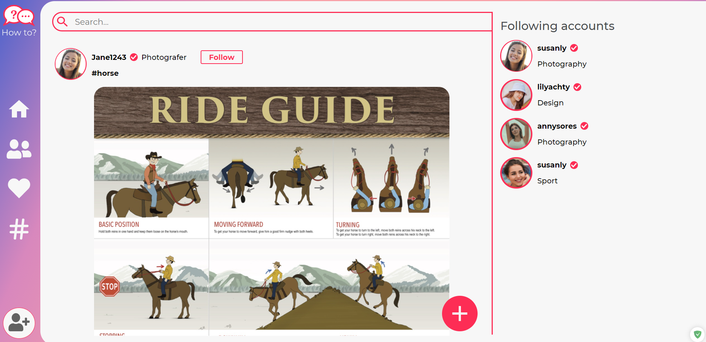
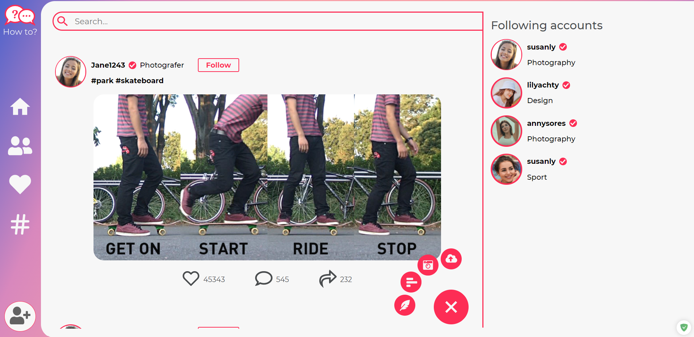

# How to?!

## Introduction

How to?! is app will help you to save your generated idea and share it with others!
This app used to express yourself through shared media allowing the user to connect to others within a set niche, connect with others going through the same experiences, post videos photos and comments.

## Built With

- HTML
- SASS
- JavaScript
- jQuery
- Sequelize
- Heroku
- Handlebars

## Web Site Link

https://app-project2.herokuapp.com/posts
